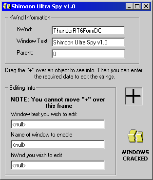



## UltraSpy 1\.0

### Description

Powerful code. Drag the "+" sign over objects in Windows and it returns information about them. Once you have gathered the required information, you can edit the object's text. (ex. Change the caption for Calculator). Also, If you can please vote, it only takes 3 seconds and it is greatly appreciated.
 
### More Info
 

             |
---                |---
**Submitted On**   |2001-05-11 15:43:20
**By**             |[Armen Shimoon](https://github.com/Planet-Source-Code/PSCIndex/blob/master/ByAuthor/armen-shimoon.md)
**Level**          |Intermediate
**User Rating**    |5.0 (25 globes from 5 users)
**Compatibility**  |VB 6\.0
**Category**       |[Windows API Call/ Explanation](https://github.com/Planet-Source-Code/PSCIndex/blob/master/ByCategory/windows-api-call-explanation__1-39.md)
**World**          |[Visual Basic](https://github.com/Planet-Source-Code/PSCIndex/blob/master/ByWorld/visual-basic.md)
**Archive File**   |[UltraSpy 1195165112001\.zip](https://github.com/Planet-Source-Code/armen-shimoon-ultraspy-1-0__1-23123/archive/master.zip)

